# iOS in Objective-C

## Table of Contents

```bash
1. Compiling and Running
1.1 Hello World Program
1.2 Compilation

1.3 Classes
1.3.1 Interface Section

1.4 Arrays
1.4.1. NSArray
1.4.2. NSMutableArray

1.5 Type Casting
1.5.1 NSUInteger to int

2. Blocks

3. Concurrency
3.1 NSThread
3.2 Thread Pool
3.3 Asynchronous Programming

4. Memory Management
4.1 Autorelease Pool

5. Core Graphics

6. Difference Between
6.1 Atomic vs non-atomic
6.2 Class vs Instance Methods
6.3 ObjectForKey vs ValueForKey
6.4 Key Value Coding vs Key Value Observing
6.5 Frame vs Bounds
6.6 Framework vs Library
6.7 Dynamic vs Static Library
6.8 Core Foundation vs Foundation


```

1. Compiling and Running

1.1 Hello World Program

```objc
main.m

#import <Foundation/Foundation.h>

int main(int argc, const char * argv[]) {

    // execute code within the autoreleasepool context
    @autoreleasepool {
        // @ - Makes the string literal a NSString object
        NSLog(@"Hello, World!);
    }
    return 0;
}
```

1.2 Compilation 

At the command line change into the Hello directory
```bash
cd Hello
ls         // main.m
```

Compile main.m with the following command:
```bash
clang -fobjc-arc  -framework Foundation main.m
```

Run with:
```bash
 ./a.out
```
or: 
```bash
clang -fobjc-arc main.m -o main
```
Run with:
```bash
 ./main
 ```

1.3 Classes

```objc
#import <Foundation/Foundation.h>
#import "Fraction.h"

int main(int argc, const char * argv[]) {
    @autoreleasepool {
  
        Fraction *fraction;
        
        fraction = [Fraction alloc];

        // *** Terminating app due to uncaught exception 'NSInvalidArgumentException', 
        // reason: '*** +[Fraction<0x1000011d0> init]: cannot init a class object.'
        fraction = [Fraction init];             // Compiler error 
        
        [fraction setNumerator:1];
        [fraction setDenominator:3];
        
        NSLog(@"The fraction is: ");
        [fraction print];
    }
    return 0;
}
```

```objc
// main.m
#import <Foundation/Foundation.h>
#import "Fraction.h"

int main(int argc, const char * argv[]) {
    @autoreleasepool {
  
        Fraction *fraction;
        
        fraction = [Fraction alloc];    // fraction = [[Fraction alloc] init];

        // Correction
        fraction = [fraction init];  
        
        [fraction setNumerator:1];
        [fraction setDenominator:3];
        
        NSLog(@"The fraction is: ");
        [fraction print];
    }
    return 0;
}
```

1.3.1 Interface section
The @interface section of the program declares all the methods in the class. 

For example:
```objc
- (void) print;
- (void) setNumerator: (int) n;
- (void) setDenominator: (int) d;
- (int) numerator;                      // Returns the numerator
- (int) denominator;                    // Returns the denominator
```

(-) Indicates that the method is an instance method. That is, an instance of the class has to be created inorder to use the method.
```objc
Fraction *fraction = [[Fraction alloc] init];  // Also Fraction *fraction = [Fraction new];
[fraction setNumerator: 1];
[fraction setDenominator: 3];
[fraction print];
```
(+) Indicates that the method is a class method. 

1.3 Array

1.3.1 NSArray

    TODO - NSARRAY

1.3.2 NSMutableArray

Reference: 
https://stackoverflow.com/questions/22153463/nsmutablearray-with-int-values-from-1-to-100

1.3.2.1 Populate a mutable array with values from 0 - 19. <br/>
Using <code>addObject:@(i)</code>

```objc
//  main.m
//  Populate a mutable array with values from 0 - 19

#import <Foundation/Foundation.h>

int main(int argc, const char * argv[]) {
    @autoreleasepool {
        
        NSMutableArray *numArray = [[NSMutableArray alloc] init];
        
        for (int i = 0; i < 20; i++) {
            [numArray addObject:@(i)];
        }
        NSLog(@"%@", numArray);
    }
    return 0;
}
```

1.3.2.2 Populate a mutable array with values from 0 - 19 <br/>
Using <code>[[NSNumber alloc] initWithInt: i]</code>

```objc
//  main.m
//  Populate a mutable array with values from 0 - 19

#import <Foundation/Foundation.h>

int main(int argc, const char * argv[]) {
    @autoreleasepool {
        
        NSMutableArray *numArray = [[NSMutableArray alloc] init];
        NSNumber *numObj;

        for (int i = 0; i < 20; i++) {
            numObj = [[NSNumber alloc] initWithInt: i];
            [numArray addObject: numObj];
        }
        NSLog(@"%@", numArray);
    }
    return 0;
}
```

1.3.2.3 Initialize a NSMutableArray with int values:
```objc
//
//  main.m

#import <Foundation/Foundation.h>

int main(int argc, const char * argv[]) {
    @autoreleasepool {
        
        NSMutableArray *numArray = [NSMutableArray arrayWithObjects:@(1), @(9), @(6), @(0), @(0), nil];
        NSLog(@"%@", numArray);
    }
    return 0;
}
```

1.3.2.4 Initialize a NSMutableArray with string values:
```objc
//
//  main.m

#import <Foundation/Foundation.h>

int main(int argc, const char * argv[]) {
    @autoreleasepool {
        
        NSMutableArray *numArray = [NSMutableArray arrayWithObjects:@("MacBook Pro"), @("iPad")), @("iPhone"), @("iPod"), @("Mac Pro"), nil];
        NSLog(@"%@", numArray);
    }
    return 0;
}
```

1.3.2.5 Iterate over NSMutableArray
1.3.2.5.1 Array of integers
```objc
//  main.m

#import <Foundation/Foundation.h>

int main(int argc, const char * argv[]) {
    @autoreleasepool {
 
        NSMutableArray *numArray = [NSMutableArray arrayWithObjects:@(5), @(9), @(3), @(0), @(7), @(1), @(0), @(4), nil];
        
        for (int i = 0; i < [numArray count]; i++) {
            NSLog(@"%@", numArray[i]);
        }
    }
    return 0;
}
```

1.3.2.5.2 Iterate over array of string values - For loop

```objc
NSArray *computers = @[@"MacPro", @"MacBook Pro", @"Mac Air", @"iPhone", @"iPad", @"iPod"];

for (int i = 0; i < [computers count]; i++) {
    NSLog(@"%@", computers[i]);
}
```

1.3.2.5.2 Iterate over array of string values - For-in loop

```objc
NSArray *devices = @[@"MacPro", @"MacBook Pro", @"Mac Air", @"iPhone", @"iPad", @"iPod"];

for (NSString *device in devices) {
    NSLog(@"%@", device);
}
```

1.3.2.6 Contained in Array
```objc
NSArray *devices = @[@"MacPro", @"MacBook Pro", @"Mac Air", @"iPhone", @"iPad", @"iPod"];
BOOL found = NO;

if ([devices containsObject: @"iPhone 6"]) {
    found = YES;
}
```

1.3.2.7 Not Contained at index
```objc
NSArray *devices = @[@"MacPro", @"MacBook Pro", @"Mac Air", @"iPhone", @"iPad", @"iPod"];
NSUInteger location = [devices indexOfObject: @"iPhone 6"];
BOOL found = NO;

if (location != NSNotFound) {
    found = YES;
}
```

1.3.2.8 Examples 
* Move zeros to front of array

1.3.2.8.1 Move all zeros to the front of an array

```objc
//  ViewController.m
//  MoveZeros

#import "ViewController.h"

@interface ViewController ()
@end

@implementation ViewController

- (void)viewDidLoad {
    [super viewDidLoad];
    // Do any additional setup after loading the view, typically from a nib.
    
    NSMutableArray *numArray = [NSMutableArray arrayWithObjects:@(0), @(5), @(9), @(3), @(0), @(7), @(1), @(0), @(4), nil];
    numArray = moveZeros(numArray);
    
    // Display new contents
    for (int i = 0; i < [numArray count]; i++) {
        NSLog(@"%@", numArray[i]);      // type of numArray is id
    }
}

NSMutableArray* moveZeros(NSMutableArray *array) {
    
    int size = (int)[array count];
    int i = 0;
    int j = size - 1;
    
    while (i < j) {
        
        // value at i is already zero
        id obj1 = [array objectAtIndex:i];
        if ([obj1 isEqualToValue:@(0)]) {
            i = i + 1;
            continue;
        }
        
        // decrement j until value zero is found
        id obj2 = [array objectAtIndex:j];
        if ([obj2 isEqualToValue:@(0)]) {
            [array exchangeObjectAtIndex:i withObjectAtIndex:j];
            i = i + 1;
        }
        
        j = j - 1;
    }
    return array;
}
@end
```

1.4 Type Casting

> typedef takes an existing type and renames it with a local identifier

```c
typedef long miles_t;             // Renames type long to miles_t locally
```

> typealias asssigns a local name to a type

1.4.1 Convert NSUInteger to integer
```c
typealias distance_t = long;      // Assigns a local name to a type
```

Per the Apple documentation, NSUInteger is a typedef of an unsigned long. A 64-bit application treats NSUInteger as a 64-bit unsigned integer.

```objc
typedef unsigned long NSUInteger;
```
NSUInteger returns a 64-bit integer value which becomes truncated on a 32-bit system.

```objc
(NSMutableArray*) moveZeros(NSMutableArray *array) {
    int size = (int)[array count];   // [array count] return type is NSUInteger

    // Useage
    for (int i = 0; i < size; i++) {
        ...
    }
}
```


2. Blocks

A block is a code segment that behaves like a function. A code block can be passes as a parameter to a function and be returned from a function. Blocks can refer to local variables that are within its scope.

2.1 General syntax

```bash
block pointer = block literal
```

```objc
return-type (^blockName)(in-params) = ^(in-params) {

    // function body

    return returntype;
}
```

2.2 Block pointer and block literal
```objc
int (^add)(int, int) = ^(int a, int b) {
    return (a + b);
}
```

2.3 Using separate statements for block pointer and block literal.
```objc
#import <Foundation/Foundation.h>

int main(int argc, char * argv[]) {
    @autoreleasepool {
        
        double (^g)(double, double);
        g = ^(double m, double n) { return m * n; };
        
        double product = g(2, 5);
        NSLog(@"%.2f", product);
    }
}
```

2.4 Declare a block with return type `int` and input type `int`

```objc
#import "ViewController.h"

@interface ViewController ()

@end

@implementation ViewController

- (void)viewDidLoad {
    [super viewDidLoad];
    [self runBlockCode];
}

- (void)runBlockCode {
    
    int (^computeBlock)(int);
    
    computeBlock = ^int (int myVar) {
        return myVar + 12;
    };
    
    int result = computeBlock(4);
    NSLog(@"\nResult: %d", result);
}
@end
```

Output:
```bash
Result: 16
```

2.5 Inferring the Block Literal Return Type
```objc
#import "ViewController.h"

@interface ViewController ()

@end

@implementation ViewController

- (void)viewDidLoad {
    [super viewDidLoad];
    [self runBlockCode];
}

- (void)runBlockCode {
    
    int (^computeBlock)(int);
    
    // compiler infers the return type
    computeBlock = ^(int myVar) {
        return myVar + 12;
    };
    
    NSLog(@"\nResult: %d", computeBlock(4));
}
@end
```

Output:
```bash
Result: 16
```

2.6 Inline Block Code
```objc
#import "ViewController.h"

@interface ViewController ()

@end

@implementation ViewController

- (void)viewDidLoad {
    [super viewDidLoad];
    [self runBlockCode];
}

- (void)runBlockCode {
    
    int (^computeBlock)(int);
    
    computeBlock = ^int (int myVar) {
        return myVar + 12;
    };
    
    NSLog(@"\nResult: %d", ^(int myVar){return myVar + 12;}(4));
}
@end
```

Output:
```bash
Result: 16
```

2.7 Blocks and Local Variables
```objc
#import "ViewController.h"

@interface ViewController ()

@end

@implementation ViewController

- (void)viewDidLoad {
    [super viewDidLoad];

    [self runBlockCode];
}

- (void)runBlockCode {
    
    int (^computeBlock)(void);
    
    int myVar = 4;
    computeBlock = ^{
        return myVar + 12;
    };
    
    NSLog(@"\nResult: %d", computeBlock());
}
@end
```

Output:
```bash
Result: 16
```

2.8 Block Local Capture at Point of Assignment

```objc
#import "ViewController.h"

@interface ViewController ()

@end

@implementation ViewController

- (void)viewDidLoad {
    [super viewDidLoad];

    [self runBlockCode];
}

- (void)runBlockCode {
    
    int (^computeBlock)(void);
    
    int myVar = 4;
    
    // block assignment captures value of myVar here
    computeBlock = ^{
        return myVar + 12;
    };
    
    myVar = 5;
    NSLog(@"\nResult: %d", computeBlock());
}
@end
```

Output:
```bash
Result: 16
```

2.9 Block Local Capture at Point of Useage

Using the `__block` variable modifier allows the block to capture the local variable value at the point where the block is used.

```objc
#import "ViewController.h"

@interface ViewController ()

@end

@implementation ViewController

- (void)viewDidLoad {
    [super viewDidLoad];

    [self runBlockCode];
}

- (void)runBlockCode {
    
    int (^computeBlock)(void);
    
    __block int myVar = 4;
    
    // block assignment captures value of myVar here
    computeBlock = ^{
        return myVar + 12;
    };
    
    myVar = 5;
    NSLog(@"\nResult: %d", computeBlock());
}
@end
```

Output:
```bash
Result: 17
```

2.10 Define and use a function block.
```objc
#import <Foundation/Foundation.h>

void blockFunc(void (^)(void));

int main(int argc, char * argv[]) {
    @autoreleasepool {
        
        // define the block function
        int (^threeMultiply)(int, int, int) = ^(int i, int j, int k) {
            int product = i * j * k;
            return product;
        };
        
        int x = 4, y = 8, z = 3;
        int result = threeMultiply(x, y, z);
        NSLog(@"%d", result);
    }
}
```

2.11 Calling a function that take a block as parameter.
```objc
#import <UIKit/UIKit.h>

void blockFunc(void (^)(void));

int main(int argc, char * argv[]) {
    @autoreleasepool {
        
        void (^f)(void) = ^(){ NSLog(@"Hello function f"); };
        blockFunc(f);
    }
}

void blockFunc(void (^g)(void)) {
    NSLog(@"In blockFunc");
    g();
}
```

2.12 Calling with a block literal as parameter
```objc
#import <Foundation/Foundation.h>

void blockFunc(void (^)(void));

int main(int argc, char * argv[]) {
    @autoreleasepool {
        
        // Calling with a block literal
        blockFunc(^{ NSLog(@"Hello, World!");});
    }
    return 0;
}

void blockFunc(void (^f)(void)) {
    NSLog(@"In block function.");
    f();
}
```

2.13 Error - none execution of the block parameter
```objc
#import <Foundation/Foundation.h>

void blockFunc(void (^)(void));

int main(int argc, char * argv[]) {
    @autoreleasepool {
        
        // Calling with a block literal
        blockFunc(^{ NSLog(@"Hello, World!");});
    }
    return 0;
}

void blockFunc(void (^f)(void)) {
    NSLog(@"In block function.");
    // f();                         /* Block param will not be called */
}

```

2.14 Using a block typedef with a block literal.
```objc
#import <Foundation/Foundation.h>

typedef void (^greetBlock)(void);
void blockFunc(greetBlock);

int main(int argc, char * argv[]) {
    @autoreleasepool {
        
        // Calling with a block literal
        blockFunc(^{ NSLog(@"Hello, World!");});
    }
    return 0;
}

void blockFunc(void (^f)(void)) {
    NSLog(@"In block function.");
    f();
}
```

2.15 Using a block typedef with a block definition.
```objc
#import <Foundation/Foundation.h>

typedef void (^greet_t)(void);

void blockFunc(greet_t);

int main(int argc, char * argv[]) {
    @autoreleasepool {
        
        // Calling with a block definition
        void (^helloWorld)(void) = ^{NSLog(@"Hello, Blocks World!");};
        blockFunc(helloWorld);
    }
    return 0;
}

void blockFunc(void (^f)(void)) {
    NSLog(@"In block function.");
    f();
}
```

2.16 Using a block typedef with a helloWorld literal
```objc
#import <Foundation/Foundation.h>

typedef void (^greet_t)(void);

void blockFunc(greet_t);

int main(int argc, char * argv[]) {
    @autoreleasepool {
        
        // Using a block typedef
        greet_t helloWorld = ^{NSLog(@"Hello, Blocks World!");};
        blockFunc(helloWorld);
    }
    return 0;
}

void blockFunc(void (^f)(void)) {
    NSLog(@"In block function.");
    f();
}
``` 

2.17 Declaring a block type <br/>

Type name - sum_t <br/>
In params - (int, int) <br/>
Return type - int <br/>

```objc
typedef int (^sum_t)(int, int);
```

2.18 Declaring a block-type variable
```objc
int (^sum_t)(int, int) sum;
```

2.19 Using a block-type variable
```objc
int (^sum)(int, int);
sum = ^(int x, int y) { return (x + y); };
        
NSLog(@"Sum: %d", sum(7, 11));
```

2.20 Passing in a block pointer with parameters
```objc
#import <Foundation/Foundation.h>

typedef int (^add_t)(int, int);

int blockFunc(add_t);

int main(int argc, char * argv[]) {
    @autoreleasepool {
        
        // Create block pointer and block literal
        int (^sumInts)(int, int) = ^(int x, int y) { return (x + y); };
        
        // Passing block pointer as paramater
        int result = blockFunc(sumInts);
        NSLog(@"result: %d", result);
    }
    return 0;
}

int blockFunc(add_t add) {
    NSLog(@"In block function.");
    
    int a = 2, b = 7;
    int output = add(a, b);
    
    return output;
}
```

2.21 Passing in a block literal as parameter
```objc
#import <Foundation/Foundation.h>

typedef int (^add_t)(int, int);

int blockFunc(add_t);

int main(int argc, char * argv[]) {
    @autoreleasepool {
        
        // Passing block literal as paramater
        int result = blockFunc(^(int x, int y) { return (x + y);});
        NSLog(@"result: %d", result);
    }
    return 0;
}

int blockFunc(add_t add) {
    NSLog(@"In block function.");
    
    int a = 2, b = 7;
    int output = add(a, b);
    
    return output;
}
```
2.22 Returning a block syntax
```objc
return-type (^block-name)(block-input-params)) (return-block-in-params);
```

2.23 Return basic math functions using blocks
```objc
#import <Foundation/Foundation.h>

typedef int (^math_t)(int, int);

math_t mathOperation(NSString *mathFunc);

int main(int argc, char * argv[]) {
    @autoreleasepool {
        
        math_t mathOp = mathOperation(@"Add");
        int sum = mathOp(6, 9);

        mathOp = mathOperation(@"Mul");
        int mul = mathOp(9, 6);
        
        NSLog(@"mathOp(6, 9): %d", sum);
        NSLog(@"mathOp(9, 6): %d", mul);
    }
}

math_t mathOperation(NSString *mathFunc) {
    
    if ([mathFunc isEqualToString:@"Add"]) {
        return ^(int a, int b) {
            return (a + b);
        };
    } else if ([mathFunc isEqualToString:@"Sub"]) {
        return ^(int a, int b) {
            return (a - b);
        };
    } else if ([mathFunc isEqualToString:@"Mul"]) {
        return ^(int a, int b) {
            return (a * b);
        };
    } else if ([mathFunc isEqualToString:@"Div"]) {
        return ^(int a, int b) {
            if (b == 0) {
                return -999;
            } else {
                return (a / b);
            }
        };
    } else {
        return ^(int a, int b) {
            return -999;
        };
    }
}
```

2.24 Refractoring the previous code to use enums
```objc
#import <Foundation/Foundation.h>

typedef int (^math_t)(int, int);
typedef NS_ENUM(NSUInteger, MathFunc) {
    ADD,
    SUB,
    MUL,
    DIV
};

math_t mathOperation(MathFunc mathFunc);

int main(int argc, char * argv[]) {
    @autoreleasepool {
        math_t mathOp = mathOperation(ADD);
        int sum = mathOp(6, 9);

        mathOp = mathOperation(MUL);
        int mul = mathOp(9, 6);
        
        NSLog(@"mathOp(6, 9): %d", sum);
        NSLog(@"mathOp(9, 6): %d", mul);
    }
}

math_t mathOperation(MathFunc mathFunc) {
    
    switch (mathFunc) {
        case ADD:
            NSLog(@"ADD");
            return ^(int a, int b) {
                return (a + b);
            };
            break;
        case SUB:
            NSLog(@"SUB");
            return ^(int a, int b) {
                return (a - b);
            };
            break;
        case MUL:
            NSLog(@"MUL");
            return ^(int a, int b) {
                return (a * b);
            };
            break;
        case DIV:
            NSLog(@"DIV");
            return ^(int a, int b) {
                if (b == 0) {
                    return -999;
                } else {
                    return (a / b);
                }
            };
            break;
        default:
            break;
    }
}
```

2.25 Pass a block into a function
```objc
#import <Foundation/Foundation.h>
#include <math.h>

typedef int (^calc_t)(int);

void mathFunc(int numArray[], int size, calc_t calc);

int main(int argc, char * argv[]) {
    @autoreleasepool {
        
        int nums[] = { 4, 9, 2, 7, 3};
        int len = 5;
        
        mathFunc(nums, len, ^(int a) {return (int)pow(a, 2.0);});
        
        // display result array
        for (int j = 0; j < len; j++) {
            NSLog(@"%d", nums[j]);
        }
    }
}

void mathFunc(int numArray[], int size, calc_t calc) {
    
    for (int i = 0; i < size; i++) {
        numArray[i] = calc(numArray[i]);
    }
}
```
2.26 Use Newton-Raphson method to find square root

```objc
/* Find square root using Newton-Raphson method
 * g0 - initial guess of the square root
 * g1 - Newton-Raphson improvement
 * f(0) - Function with initial guess
 * f'(0) - Derivative of function with initial guess
 * g1 = g0 - f(0)/ f'(0)
 * 
 * Example: Find the square root of 10.
 *
 * let x = initial guess.
 * then x = square_root(10) is the problem to solve.
 * square both sides of the equation.
 * x^2 = 10
 * x^2 - 10 = 0
 * let f(x) = x^2 - 10
 * derivative f(x) = f'(x) = 2x
 * Newton-Raphson formula:
 * let x1 = new guess
 * x1 = x - f(x)/ f'(x)
 * giving, x1 = x - (x^2 - 10) / 2x
 * then, x1 = 2x/2 - (x - 10/x)/2 = (x + 10/x)/2
 * let n = input number 
 * so in general, g1 = (g0 + n/g0)/2
 */

#import <Foundation/Foundation.h>
#include <math.h>

double sqrt(double n);
double absVal(double n);

int main(int argc, const char* argv[]) {
    double number = 10.0;
    double root = sqrt(number);
    NSLog(@"root: %.4f\n", root);
}

double sqrt(double n) {
    
    double g = n / 2.0;          // start with a guess of the sqrt
    double error = 0.00001;
    
    while (absVal(n - g*g) > error)
    {
        g = (g + n/g) / 2.0;    // Newton-Raphson sqrt formula
    }
    return g;
}

double absVal(double n) {
    double val = (n < 0) ? -1 * n : n;
    return val;
}
```

2.27 Newton-Raphson implementaton with blocks
```objc
#import <Foundation/Foundation.h>
#include <math.h>

typedef double(^sqrt_t)(double);
double absVal(double n);

int main(int argc, const char* argv[]) {
    
    double number = 12.0;
    sqrt_t sqrt = ^(double n){
        double g = n / 2.0;          // start with a guess of the sqrt
        double error = 0.00001;
        
        while (absVal(n - g*g) > error) {
            g = (g + n/g) / 2.0;    // Newton-Raphson sqrt formula
        }
        return g;
    };
    
    double root = sqrt(number);
    NSLog(@"root: %.4f\n", root);
}

double absVal(double n) {
    double val = (n < 0) ? -1 * n : n;
    return val;
}
```


2.28 Use blocks to return a sort function. <br/>
Return type - NSArray (^)(NSMutableArray) <br/>
Block name - sortAlgo <br/>
Block input param - NSString * <br/>

```objc
NSArray* (^sortAlgo(NSString *)) (NSMutableArray *);
```

Using a block as return-type
```objc
typdef NSArray* (^algo_t)(NSMutableArray *);
``` 

3. View Programming Guide

3.x View Hierarchy


<p align="center">
  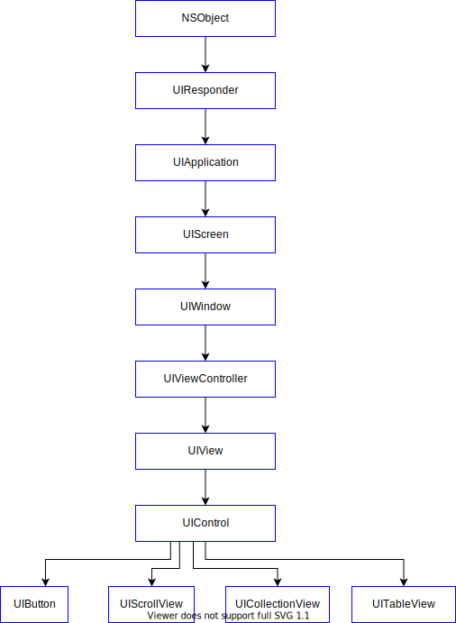 
</p>

3.x UIScreen

UIScreen is associated with the physical properties of the hardware device. The Apple reference document mentions that, "iOS devices may have a main screen and zero or more attached screens."

UIScreen properties: 
* Screen dimension expressed as screen bounds.
* Screen orientation - portrait or landscape mode.
* Screen brightness

The bounds rectangle associated with the main screen can be obtain is code a listed below.

```objc
CGFloat screenWidth = [UIScreen mainScreen].bounds.size.width;
CGFloat screenHeight = [UIScreen mainScreen].bounds.size.height;
```

3.x UIScreen Dimension in Landscape and Portrait Mode

```objc
- (void)deviceDidRotate:(NSNotification *)notification
{
    UIDeviceOrientation currentOrientation = [[UIDevice currentDevice] orientation];
    
    if (!UIDeviceOrientationIsValidInterfaceOrientation(currentOrientation)) {
        return;
    }
    
    BOOL isLandscape = UIDeviceOrientationIsLandscape(currentOrientation);
    BOOL isPortrait = UIDeviceOrientationIsPortrait(currentOrientation);
    
    CGFloat screenWidth = [UIScreen mainScreen].bounds.size.width;
    CGFloat screenHeight = [UIScreen mainScreen].bounds.size.height;
    
    if (isLandscape) {
        NSLog(@"isLandscape");
        NSLog(@"screen width: %.1f", screenWidth);
        NSLog(@"screen height: %.1f", screenHeight);
        NSLog(@"view width: %.1f", self.view.bounds.size.width);
        NSLog(@"view height: %.1f", self.view.bounds.size.height);
    } else if (isPortrait) {
        NSLog(@"isPortrait");
        NSLog(@"screen width: %.1f", screenWidth);
        NSLog(@"screen height: %.1f", screenHeight);
        NSLog(@"view width: %.1f", self.view.bounds.size.width);
        NSLog(@"view height: %.1f", self.view.bounds.size.height);
    }
}
```

Output - Landscape Mode

```bash
isLandscape
screen width: 568.0
screen height: 320.0
view width: 568.0
view height: 320.0
```

Output - Portrait Mode

```bash
isPortrait
screen width: 320.0
screen height: 568.0
view width: 320.0
view height: 568.0
```

<p align="center">
  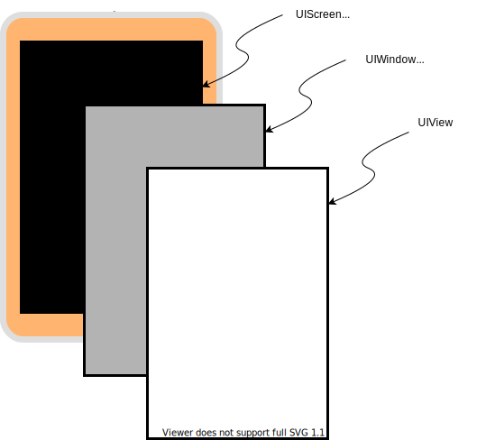 
</p>

3.x UIWindow

Each iOS application has a least one main window that is set to the size of the screen bounds. It is a blank container for views and is generally created by the Application delegate during startup.

```objc
self.window = [[UIWindow alloc] initWithFrame: [[UIScreen mainScreen] bounds]]];
```

A view controller view can be added to the main window with the following listing.

```objc
[self.window addSubView: viewController.view];
```

Responsibilities of a window
* Contains the application's visible content.
* Listens for and delivers touch events to the views.
* Passes orientation changes from the screen to the view controllers.
* Listens for keyboard events.

3.x UIKit MVC Design Pattern

The UIApplication object is a singleton object that runs the application's main event loop and the application's lifecycle. It listens for system events, such as low memory warning, and user events, such as moving the application to the background and returning to the foreground. UIApplication delegate methods manage the lifecycle of the application.

<p align="center">
   
</p>

3.x Add SubView to ViewController View Property

```bash
# view controller view property
@property(null_resettable, nonatomic,strong) UIView *view;
```

Views are positioned with respect to their parent view coordinate system. In the code below, blueView is positioned x:20, y:20 in parent, self.view.

<p align="center">
   
</p>


> Note: Change the view's background color to other than white for the view to be visible.

```objc
#import "ViewController.h"

@interface ViewController ()
@property (nonatomic, strong) UIView *blueView;
@end

@implementation ViewController

- (void)viewDidLoad {
    [super viewDidLoad];
    
    self.blueView = [[UIView alloc] initWithFrame:CGRectMake(20, 20, 100, 100)];

    // set backgroundColor is required to see view
    self.blueView.backgroundColor = [UIColor blueColor];

    // blue view position is with repect to parent, view, coordinate system
    [self.view addSubview:self.blueView];
}
@end
```

3.x Add Second SubView to ViewController View Property

In the code below, greenView is positioned relative to the frame of the viewcontroller's view  (view). 
Since both blueView and greenView have the same coordinates, (x:20, y:20) they are both drawn from the same point.

<p align="center">
   
</p>

```objc
#import "ViewController.h"

@interface ViewController ()
@property (nonatomic, strong) UIView *blueView;
@end

@implementation ViewController

- (void)viewDidLoad {
    [super viewDidLoad];
    
    self.blueView = [[UIView alloc] initWithFrame:CGRectMake(20, 20, 100, 100)];
    self.blueView.backgroundColor = [UIColor blueColor];
    [self.view addSubview:self.blueView];
    
    CGRect greenRect = CGRectMake(20, 20, 60, 60);
    UIView *greenView = [[UIView alloc] initWithFrame:greenRect];
    greenView.backgroundColor = [UIColor greenColor];

    // add second subview
    [self.view addSubview:greenView];
}
@end
```

3.x Add View to SubView

On adding greenView to blueView, greenView is positioned relative to its parent, blueView, coordinate system.

<p align="center">
  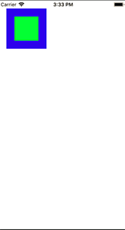 
</p>


```objc
#import "ViewController.h"

@interface ViewController ()
@property (nonatomic, strong) UIView *blueView;
@end

@implementation ViewController

- (void)viewDidLoad {
    [super viewDidLoad];
    
    self.blueView = [[UIView alloc] initWithFrame:CGRectMake(20, 20, 100, 100)];
    self.blueView.backgroundColor = [UIColor blueColor];
    [self.view addSubview:self.blueView];
    

    CGRect greenRect = CGRectMake(20, 20, 60, 60);
    UIView *greenView = [[UIView alloc] initWithFrame:greenRect];
    greenView.backgroundColor = [UIColor greenColor];
    [self.blueView addSubview:greenView];
}
@end
```

3.x Center a SubView in SuperView

The code listing below, centers a subview in its superview, by setting the view to an intrinsic content size equal to the minimum of the bounds width and bounds height. Autolayout constraints, set in the view controller, positions the view at the center of the superview. In this way, the circle, which is drawn in the center of the view in both portrait and landscape mode.

<p align="center">
  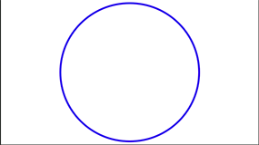 
</p>

```objc
//  BlueView.m
//  ViewProperties
//  Reference: iOS Programming: The Big Nerd Ranch Guide

#import "BlueView.h"

@implementation BlueView

- (void)drawRect:(CGRect)rect {
    
    CGRect bounds = self.bounds;
    CGPoint midPoint;
    midPoint.x = bounds.origin.x + bounds.size.width / 2.0;
    midPoint.y = bounds.origin.y + bounds.size.height / 2.0;
    float circleRadius = MIN(bounds.size.width - 10, bounds.size.height - 10) / 2.0;
    
    UIBezierPath *path = [[UIBezierPath alloc] init];
    [path addArcWithCenter: midPoint
                    radius:circleRadius
                startAngle:0.0
                  endAngle: M_PI * 2.0
                 clockwise: YES
     ];
    path.lineWidth = 4;
    [[UIColor blueColor] setStroke];
    [path stroke];
}

// set a fixed content size so viewcontroller can center blueview in superview
- (CGSize) intrinsicContentSize {
    CGRect bounds = self.bounds;
    
    float dimension = MIN(bounds.size.width - 4, bounds.size.height - 4);
    return CGSizeMake(dimension, dimension);
}
@end

//  ViewController.m
//  ViewProperties
//  Reference: https://stackoverflow.com/questions/14011395/ios-position-uiview-in-center-of-superview-using-auto-layout-programmatically

#import "ViewController.h"
#import "BlueView.h"

@interface ViewController ()
@property (nonatomic, strong) UIView *blueView;
@end

@implementation ViewController

- (void)viewDidLoad {
    [super viewDidLoad];
    
    CGRect bounds = self.view.bounds;
    self.blueView = [[BlueView alloc] initWithFrame:bounds];
    self.blueView.backgroundColor = [UIColor whiteColor];
    
    self.blueView.translatesAutoresizingMaskIntoConstraints = NO;
    [self.view addSubview:self.blueView];
    
    // center blueview in superview with autolayout constraints
    NSLayoutConstraint *blueViewX = [NSLayoutConstraint constraintWithItem:self.blueView
                                                                            attribute:NSLayoutAttributeCenterX
                                                                            relatedBy:NSLayoutRelationEqual
                                                                               toItem:self.view
                                                                            attribute:NSLayoutAttributeCenterX
                                                                           multiplier:1.0
                                                                             constant:0];
    NSLayoutConstraint *blueViewY = [NSLayoutConstraint constraintWithItem:self.blueView
                                                                            attribute:NSLayoutAttributeCenterY
                                                                            relatedBy:NSLayoutRelationEqual
                                                                               toItem:self.view
                                                                            attribute:NSLayoutAttributeCenterY
                                                                           multiplier:1.0
                                                                             constant:0];
    [self.view addConstraints:@[blueViewX, blueViewY]];
}
@end
```


3.x View ClipsToBounds

<p align="center">
  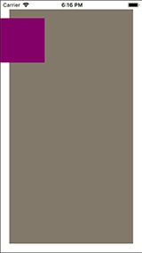 
  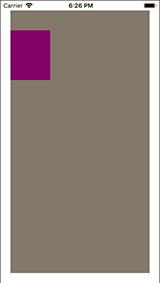 
</p>

```objc
#import "ViewController.h"

@interface ViewController ()

@end

@implementation ViewController

- (void)viewDidLoad {
    [super viewDidLoad];
    // Do any additional setup after loading the view, typically from a nib.
    CGFloat width = self.view.bounds.size.width - 40;
    CGFloat height = self.view.bounds.size.height - 40;
    
    UIView *grayView = [[UIView alloc] initWithFrame:CGRectMake(20.0, 20.0, width, height)];
    grayView.backgroundColor = [UIColor grayColor];
    [self.view addSubview:grayView];
    
    UIView *purpleView = [[UIView alloc] initWithFrame:CGRectMake(-20.0, 40.0, 100.0, 100.0)];
    purpleView.backgroundColor = [UIColor purpleColor];
    [grayView addSubview:purpleView];
    
    // clip overlap
    grayView.clipsToBounds = YES;
}
@end
```

3.x View Lifecycle

* loadView - Called automatically when the viewcontroller view property is accessed.
* viewDidLoad - Called automatically when the view is finished loading in memory.
* viewWillAppear
* viewWillLayoutSubviews - Called whenever the view controller view bounds is changed. Rotation, view loaded, view size change.
* viewDidLayoutSubviews
* viewDidAppear - Perform UI animation here.
* viewWillDisappear - Dismiss the keyboard, save state as needed.
* viewDidDisappear - Stop any background task and cancel any network request.
* didReceiveMemoryWarning - Deallocate objects from memory where able.

```objc
    override func viewDidLoad() {
        super.viewDidLoad()
    }

    override func didReceiveMemoryWarning() {
        super.didReceiveMemoryWarning()
    }
    
    override func viewWillLayoutSubviews() {
        super.viewWillLayoutSubviews()
        print("viewWillLayoutSubviews")
    }
    
    override func loadView() {
        super.loadView()
        print("loadView")
    }
```


4. Core Animation

The Core Animation framework sits just below the UIKit framework in the iOS framework hierarchy. It allows developers to animate UIView objects. All animations are applied to objects of class CALayer.

<p align="center">
  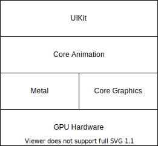 
</p>

Class CAAnimation is the abstract superclass of the Core Animation framework. CAAnimation conforms to protocols CAAction, CAMediaTiming, NSCopying, NSSecureCoding, SCNAnimationProtocol. Since CAAnimation is an abstract class, animation objects cannot be created directly from it. Animation objects are created from classes CABasicAnimation, CAKeyframeAnimation, CAAnimationGroup and CATransition. These are all concrete subclasses of class CAAnimation.

The image below shows the Core Animation class inheritance hierarchy. 
<p align="center">
   
</p>


3.1 Compare Layers and Views

Layer objects (layers) are 2D surfaces that act as models for UIView objects (views). As such, layers maintain data about the visual attributes associated with views. A layer does this by caching view data in a bitmap. Rendering of layer state information is performed by the graphics hardware.

Changes using view-based drawing makes a call to method `drawRect:` which is performed on the main thread by the CPU. 

Layers differ from view in the following respects:
* Layers do not respond to events
* Layers do not participate in the UIResponder chain
* Layers do not draw their content
* Layers have anchor points around manipulations can occur.

> "Views are a thin wrapper around layer objects."

3.2 Frame and Bounds


3.3  Animate a UIView Object

The example below uses a start button to animate a UIView from position x: 70, y: 80 to x: 200, y: 300. Button reset  set the view object back to the start position.

```objc
//  ViewController.m
//  AnimateSquare
//  Purpose: Animates a blue box from (x: 70, y: 80) to (x: 200, y: 300)

#import "ViewController.h"

@interface ViewController ()

@property (weak, nonatomic) IBOutlet UIView *blueBox;

@end

@implementation ViewController

- (void)viewDidLoad {
    [super viewDidLoad];
    [self.blueBox setCenter:CGPointMake(70.0, 80.0)];
}

- (IBAction) start:(id)sender {
    
    // block implicity retains 'self'
    [UIView animateWithDuration:3.0 animations:^{
        [ self.blueBox setCenter:CGPointMake(200.0, 300.0)];
    }];
}

- (IBAction) reset:(id)sender {
        [self.blueBox setCenter:CGPointMake(70.0, 80.0)];
}
@end
```

3.3 Animating UIViews with BlockObjects
```bash
+ animateWithDuration:delay:animations:completion:
```

Animate a box from x: 70, y: 80 to x 200, y: 300. On completion, stop at start position.
```objc
//  ViewController.m
//  AnimateSquare

#import "ViewController.h"

@interface ViewController ()
@property (weak, nonatomic) IBOutlet UIView *blueBox;
@end

@implementation ViewController

- (void)viewDidLoad {
    [super viewDidLoad];
    // Do any additional setup after loading the view, typically from a nib.
    [self.blueBox setCenter:CGPointMake(70.0, 80.0)];
}

- (IBAction)start:(id)sender {
    [UIView animateWithDuration:3.0
                                   delay:0.0
                                 options:(UIViewAnimationCurveEaseInOut | UIViewAnimationOptionAutoreverse)
                              animations:^{
                                  [self.blueBox setCenter:CGPointMake(200, 300)];
                              }
                              completion: ^(BOOL finished) {
                                  [self.blueBox setCenter:CGPointMake(70, 80)];
                              }];
}
@end
```

3.4 Animate with BlockObject - TapGestureRecognizer
```bash
+ animateWithDuration:animations:
```

```objc
#import "ViewController.h"

@interface ViewController ()
@property (weak, nonatomic) IBOutlet UIView *blueBox;
@end

@implementation ViewController

- (void)viewDidLoad {
    [super viewDidLoad];
    [self.blueBox setCenter:CGPointMake(70, 70)];
    
    UITapGestureRecognizer*tapGesture = [[UITapGestureRecognizer alloc] initWithTarget:self action:@selector(startAnimation:)];
    [self.blueBox addGestureRecognizer:tapGesture];
}

- (void) startAnimation: (UIGestureRecognizer *) gesture {
    [UIView animateWithDuration:0.5 animations:^{
        [self.blueBox setCenter:CGPointMake(70, 300)];
    }];
}
@end
```

3.5 Animate with BlockObject - TapGestureGRecognizer

```bash
+ animateWithDuration:animations:completion:
```

```objc
#import "ViewController.h"

@interface ViewController ()
@property (weak, nonatomic) IBOutlet UIView *blueBox;
@end

@implementation ViewController

- (void)viewDidLoad {
    [super viewDidLoad];
    [self.blueBox setCenter:CGPointMake(70, 70)];
    
    UITapGestureRecognizer*tapGesture = [[UITapGestureRecognizer alloc] initWithTarget:self action:@selector(startAnimation:)];
    [self.blueBox addGestureRecognizer:tapGesture];
}

- (void) startAnimation: (UIGestureRecognizer *) gesture {
    
    [UIView animateWithDuration:3.0
                          delay:0.0
                        options:(UIViewAnimationCurveEaseInOut | UIViewAnimationOptionAutoreverse)
                     animations:^{
                         [self.blueBox setCenter:CGPointMake(70, 300)];
                     }
                     completion: ^(BOOL finished) {
                         [self.blueBox setCenter:CGPointMake(70, 70)];
                     }];
}
@end
```


3.6 Animate with Keyframe Animation
```bash
+ animateKeyframesWithDuration:delay:options:animations:completion:
```
```objc
// Blue box oscillates between its start and end positions.

#import "ViewController.h"

@interface ViewController ()
@property (weak, nonatomic) IBOutlet UIView *blueBox;
@end

@implementation ViewController

- (void)viewDidLoad {
    [super viewDidLoad];
    // Do any additional setup after loading the view, typically from a nib.
    [self.blueBox setCenter:CGPointMake(70.0, 80.0)];
}


- (IBAction)start:(id)sender {
    
    [UIView animateKeyframesWithDuration:3.0
                                   delay:0.0
                                 options: UIViewKeyframeAnimationOptionRepeat | UIViewKeyframeAnimationOptionAutoreverse
                              animations:^{
                                  [self.blueBox setCenter:CGPointMake(200, 300)];
                              }
                              completion: nil
                            ];
}
@end
```

3.7 Animate with UIViewPropertyAnimator

```objc
#import "ViewController.h"

@interface ViewController ()
@property (weak, nonatomic) IBOutlet UIView *blueBox;
@end

@implementation ViewController

- (void)viewDidLoad {
    [super viewDidLoad];
    [self.blueBox setCenter:CGPointMake(70, 70)];
    
    UITapGestureRecognizer*tapGesture = [[UITapGestureRecognizer alloc] initWithTarget:self action:@selector(startAnimation:)];
    [self.blueBox addGestureRecognizer:tapGesture];
}

- (void) startAnimation: (UIGestureRecognizer *) gesture {
    
    UIViewPropertyAnimator *animator = [[UIViewPropertyAnimator alloc] initWithDuration:2.0 curve:UIViewAnimationCurveLinear animations:^{
        [self.blueBox setCenter:CGPointMake(70, 300)];
    }];
    [animator startAnimation];
    [animator addCompletion: ^(UIViewAnimatingPosition finalPosition) {
        [self.blueBox setCenter:CGPointMake(70, 70)];
    }];
}
@end
```

3.8 Animate with UIViewPropertyAnimator - IBAction

```objc
#import "ViewController.h"

@interface ViewController ()
@property (nonatomic) UIView *rectView;
@property (nonatomic) UIViewPropertyAnimator *animator;
@end

@implementation ViewController

- (void)viewDidLoad {
    [super viewDidLoad];
    self.rectView = [[UIView alloc] initWithFrame:CGRectMake(50, 50, 50, 50)];
    self.rectView.backgroundColor = [UIColor redColor];
    [self.view addSubview:_rectView];
}

- (void)runAnimation {
    // avoid a retain cycle in closure
    typeof(self)__weak weakSelf = self;
    
    // it is safe to allow the animation block to capture self. 
    self.animator = [[UIViewPropertyAnimator alloc] initWithDuration:4 curve:UIViewAnimationCurveLinear animations:^{
        self.rectView.frame = CGRectMake(150, 150, 150, 150);
    }];
    
    // capturing self strongly inside the block can create a retain cycle
    [self.animator addCompletion:^(UIViewAnimatingPosition finalPosition) {
        if (finalPosition == UIViewAnimatingPositionEnd) {
            weakSelf.rectView.frame = CGRectMake(50, 50, 50, 50);
        }
    }];
    
    [self.animator startAnimation];
}

- (IBAction)start:(id)sender {
    [self runAnimation];
}

- (IBAction)pause:(id)sender {
    [self.animator pauseAnimation];
}

- (IBAction)resume:(id)sender {
    UISpringTimingParameters *params = [[UISpringTimingParameters alloc] initWithDampingRatio:0.3];
    [self.animator continueAnimationWithTimingParameters:params durationFactor:1];
}

- (IBAction)stop:(id)sender {
    [self.animator stopAnimation:YES];
}

@end
```

3.9 CAAnimation - Linear Motion from ViewDidLoad

In this example, a blue view is moves linearly along the y-axis, while a green view moves along the x-axis. Animation starts immediately.

<p align="center">
  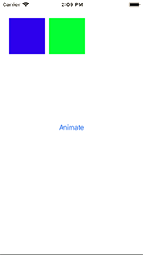 
  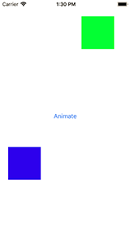
</p>

```objc
//  Animate from a start position to an end position
#import "ViewController.h"

@interface ViewController ()
@property (strong, nonatomic) UIView *blueView;
@property (strong, nonatomic) UIView *greenView;
@end

@implementation ViewController

- (void)viewDidLoad {
    [super viewDidLoad];
 
    self.blueView = [[UIView alloc] initWithFrame:CGRectMake(20, 40, 80, 80)];
    self.greenView = [[UIView alloc] initWithFrame:CGRectMake(110, 40, 80, 80)];
    
    [self.blueView setBackgroundColor:[UIColor blueColor]];
    [self.greenView setBackgroundColor:[UIColor greenColor]];
    [self.view addSubview:self.blueView];
    [self.view addSubview:self.greenView];
    
    CGFloat startY = self.blueView.layer.position.y;
    self.blueView.layer.position = CGPointMake(self.blueView.layer.position.x, 400);
    CABasicAnimation *blueMotion = [CABasicAnimation animationWithKeyPath:@"position.y"];
    blueMotion.fromValue = @(startY);
    blueMotion.duration = 2.0;
    
    CGFloat startX = self.greenView.layer.position.x;
    self.greenView.layer.position = CGPointMake(240, self.greenView.layer.position.y);
    CABasicAnimation *greenMotion = [CABasicAnimation animationWithKeyPath:@"position.x"];
    greenMotion.fromValue = @(startX);
    greenMotion.duration = 2.0;

    [self.blueView.layer addAnimation:blueMotion forKey:@"position"];
    [self.greenView.layer addAnimation:greenMotion forKey:@"position"];
}
@end
```

3.10 CAAnimation - Linear Motion from Button Action

In this example, a blue view is moves linearly along the y-axis, while a green view moves along the x-axis. Animation starts with button action. The button is added programmatically and so uses autolayout to position it in the view.

```objc
#import "ViewController.h"

@interface ViewController ()
@property (nonatomic, strong) UIView *blueView;
@property (nonatomic, strong) UIView *greenView;
@end

@implementation ViewController

- (void)viewDidLoad {
    [super viewDidLoad];
 
    self.blueView = [[UIView alloc] initWithFrame:CGRectMake(20, 40, 80, 80)];
    self.greenView = [[UIView alloc] initWithFrame:CGRectMake(110, 40, 80, 80)];
    
    [self.blueView setBackgroundColor:[UIColor blueColor]];
    [self.greenView setBackgroundColor:[UIColor greenColor]];
    
    [self.view addSubview:self.blueView];
    [self.view addSubview:self.greenView];
    [self addButton];

}

- (void) addButton {
    
    // creat button and add to the superview
    UIButton *button = [UIButton buttonWithType:UIButtonTypeRoundedRect];
    button.translatesAutoresizingMaskIntoConstraints = NO;
    [button setTitle:@"Animate" forState:UIControlStateNormal];
    [self.view addSubview:button];
    
    // add constraints
    NSLayoutConstraint *buttonXConstraints = [NSLayoutConstraint constraintWithItem:button
                                                                          attribute:NSLayoutAttributeCenterX
                                                                          relatedBy:NSLayoutRelationGreaterThanOrEqual
                                                                             toItem:self.view
                                                                          attribute:NSLayoutAttributeCenterX
                                                                         multiplier:1.0
                                                                           constant:0.0f];
    NSLayoutConstraint *buttonYConstraints = [NSLayoutConstraint constraintWithItem:button
                                                                          attribute:NSLayoutAttributeCenterY
                                                                          relatedBy:NSLayoutRelationEqual
                                                                             toItem:self.view
                                                                          attribute:NSLayoutAttributeCenterY
                                                                         multiplier:1.0
                                                                           constant:0.0f];
    [self.view addConstraints:@[buttonXConstraints, buttonYConstraints]];
    [button addTarget:self action:@selector(animateAction:) forControlEvents:UIControlEventTouchUpInside];
}

- (void) animateAction: (UIButton *) sender {
    
    // Animate blue view
    CGFloat startY = self.blueView.layer.position.y;
    self.blueView.layer.position = CGPointMake(self.blueView.layer.position.x, 400);
    CABasicAnimation *blueMotion = [CABasicAnimation animationWithKeyPath:@"position.y"];
    blueMotion.fromValue = @(startY);
    blueMotion.duration = 2.0;
    
    // Animate green view
    CGFloat startX = self.greenView.layer.position.x;
    self.greenView.layer.position = CGPointMake(240, self.greenView.layer.position.y);
    CABasicAnimation *greenMotion = [CABasicAnimation animationWithKeyPath:@"position.x"];
    greenMotion.fromValue = @(startX);
    greenMotion.duration = 2.0;
    
    [self.blueView.layer addAnimation:blueMotion forKey:@"position"];
    [self.greenView.layer addAnimation:greenMotion forKey:@"position"];
}

@end
```


4. Concurrency

4.1 NSRunLoop
```objc
#import "ViewController.h"

@interface ViewController ()
- (void) runLoopFunc;
@end

@implementation ViewController

- (void)viewDidLoad {
    [super viewDidLoad];
    // Do any additional setup after loading the view, typically from a nib.
    
    [self runLoopFunc];
}

- (void) runLoopFunc {
    Boolean runFlag = YES;
    NSDate *loopUntil = [NSDate dateWithTimeIntervalSinceNow:1];
    int count = 0;
    
    while (runFlag && [[NSRunLoop currentRunLoop] runMode: NSDefaultRunLoopMode beforeDate:loopUntil]) {
        loopUntil = [NSDate dateWithTimeIntervalSinceNow:1];
        count += 1;
        NSLog(@"looping ... %d", count);
 
        if (count > 20) {
            break;
        }
    }
}
@end
```


3.1 NSThread
3.2 Thread Pool

3.3 Grand Central Dispatch (GCD)


3.4 Asynchronous Programming

Asynchronous programming in iOS can be achieved using the following:

* Notification Center
* GCD
* Operations
* Closure Callbacks
* Delegates
* Timers


4. Memory Management

```objc
- (void) setName: (NSString *) name {
    [_name release];
    _name = name;
    [_name retain];
}
```

4.1 Memory Management - Closure Blocks

Capturing `self` inside a closure block can create a strong reference cycle (aka retain cycle). Avoid a retain cycle in a closure by creating a weak reference to `self` as in 
```bash
__typeof(self) __weak weakSelf = self;
```
In the case of `animateWithDuration`, the animation stops when the uiview is dismissed and the strong reference is terminated, so there is no strong reference cycle.

> It is safe to allow animation blocks to capture self.

```objc
- (void)runAnimation {
    // avoid a retain cycle in closure, create a weak reference to `self`
    __typeof(self)__weak weakSelf = self;
    
    // it is safe to allow the animation block to capture self. 
    self.animator = [[UIViewPropertyAnimator alloc] initWithDuration:4 curve:UIViewAnimationCurveLinear animations:^{
        self.rectView.frame = CGRectMake(150, 150, 150, 150);
    }];
    
    // capturing self strongly inside the block can create a retain cycle
    [self.animator addCompletion:^(UIViewAnimatingPosition finalPosition) {
        if (finalPosition == UIViewAnimatingPositionEnd) {
            weakSelf.rectView.frame = CGRectMake(50, 50, 50, 50);
        }
    }];
    
    [self.animator startAnimation];
}
```

4.2 Autoreleasepool Context


4.3 Properties

4.3.1 Copy storage semantics
```objc
@property (nonatomic, copy) drawing_t drawingBlock; 
```
Use copy so that the block is moved to the heap and doesn't disappear when the scope in which it was created terminates.


The autoreleasepool is a mechanism that allows the system to efficiently manage the memory your application uses as it creates new objects. Ownership of data is temporarily transferred to the run loop, for data that can be disposed at the end of the run loop cycle or should be claimed before the end of the loop cycle.

4.3.2 Atomic property attribute

```objc
@property (strong, atomic) NSString *firstName;
```
Since the default attribute is atomic, adding atomic is not necessary.

```objc
@property (strong) NSString *firstName;
```

Atomic property attribute:

```objc
@synthesize firstName = _firstName;
-(NSString *)firstName{
    @synchronized (self) {
        return _firstName;
    }
}
-(void)setFirstName:(NSString *)firstName{
    @synchronized (self) {
        if(_firstName != firstName){
            [_firstName release];
            _firstName = [firstName retain];
        }
    }
}
```

Nonatomic property attribute:

```objc
@property (strong, nonatomic) NSString *firstName;
```

```objc
@synthesize firstName = _firstName;
-(NSString *)firstName {
    return _firstName;
}
-(void)setFirstName:(NSString *)firstName{
    if(_firstName != firstName){
        [_firstName release];
        _firstName = [firstName retain];
    }
}
```


4.3.x Property Accessor Naming

Property accessor names cannot begin with new.

```objc
// Incorrect
@property NSString *newFeatureName;

// Correct
@property (getter=theNewFeatureName) NSString *newFeatureName;
```

4.x Property Attribute List

* `strong` replaced `retain` attribute starting with iOS 4. `strong` is used with parent objects such as UI elements that are programmatically created. In the listing below, grayView and purpleView are both created programmatically instead of with Storyboard.

<p align="center">
  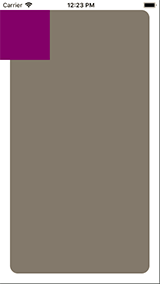 
  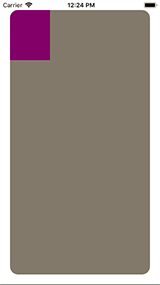
</p>

```objc
#import "ViewController.h"

@interface ViewController ()

@property (strong, nonatomic) UIView *grayView;
@property (strong, nonatomic) UIView *purpleView;

@end

@implementation ViewController

- (void)viewDidLoad {
    [super viewDidLoad];
 
    CGRect frame = self.view.frame;
    CGFloat width = CGRectGetWidth(frame) - 40;
    CGFloat height = CGRectGetHeight(frame) - 40;
    
    self.grayView = [[UIView alloc] initWithFrame:CGRectMake(20.0, 20.0, width, height)];
    self.grayView.backgroundColor = [UIColor grayColor];
    self.grayView.layer.cornerRadius = 16;
    [self.view addSubview:self.grayView];
    
    UIView *purpleView = [[UIView alloc] initWithFrame:CGRectMake(-20.0, 0.0, 100.0, 100.0)];
    purpleView.backgroundColor = [UIColor purpleColor];
    [self.grayView addSubview:purpleView];
    
    // clip overlap
    self.grayView.clipsToBounds = YES;
    
    // or use masktobounds on the layer property
    //self.grayView.layer.masksToBounds = YES;
}
@end
```

* `weak` replaced `assign` attribute starting with iOS 4. `weak` is most noticable with IBOutlets created from Storyboards. `weak` is also used with view delegates. If the parent object is deallocated this object is set to `nil`.

```objc
@property (weak, nonatomic) 
```

```objc
#import "ViewController.h"

@interface ViewController ()

// weak is used with Storyboard UI components
@property (weak, nonatomic) IBOutlet UIView *blueBox;

@end

@implementation ViewController

- (void)viewDidLoad {
    [super viewDidLoad];
    [self.blueBox setCenter:CGPointMake(70.0, 80.0)];
}

- (IBAction)start:(id)sender {
    [UIView animateKeyframesWithDuration:3.0
                                   delay:0.0
                                 options: UIViewKeyframeAnimationOptionRepeat | UIViewKeyframeAnimationOptionAutoreverse
                              animations:^{
                                  [self.blueBox setCenter:CGPointMake(200, 300)];
                              }
                              completion: nil
                            ];
}
@end
```

* `copy` can be used with classes that conform to the NSCopying protocol. These include NSString, NSArray, NSDictionary, NSAttributedString, NSData, NSValue.

```objc
#import "ViewController.h"
#import "Computer.h"

// private properties
@interface ViewController ()

@end

@implementation ViewController

- (void)viewDidLoad {
    [super viewDidLoad];
    
    Computer *computer = [[Computer alloc] init];
    NSMutableString *modelName = [NSMutableString stringWithFormat:@"Apple"];
    
    computer.model = modelName;
    NSLog(@"computer brand: %@", computer.model);
    
    [modelName appendString:@", Corporation"];
    NSLog(@"computer brand with copy attribute: %@", computer.model);
    
    NSMutableString *diagonalSize = [NSMutableString stringWithFormat:@"15.4"];
    computer.screenSize = diagonalSize;
    NSLog(@"screen size: %@", computer.screenSize);
    
    computer.screenSize = @"17";
    NSLog(@"screen size with strong attribute: %@", computer.screenSize);
                                     
}

@end
```

Output:

```bash
computer brand: Apple
computer brand with copy attribute: Apple
screen size: 15.4
screen size with strong attribute: 17
```

Immutable collection types should have a `copy` property.

```objc
@property (copy, nonatomic) NSArray *array;
```

* `readonly` attribute allows the property to be set only once by its parent object. Other objects can only read the value of the property.

```objc
@interface Shoes: NSObject

@property (readonly, nonatomic) float cost;
@property (readonly, nonatomic) float size;

@end
```

* `readwrite` is the default and so is not generally included in the @property declaration.

```objc
@interface ComputerMonitor: NSObject

@property (nonatomic) int width;
@property (nonatomic) int height;
@property (readonly, nonatomic) int diagonal;

@end
```

This is equivalent to getter and setter methods:

```objc
- (int) width;
- (int) setWidth:(int)newValue;

- (int) height;
- (int) setHeight:(int)newValue;

- (int) diagonal;
```

* `atomic` - a synthesized get accessor for an object property uses a lock and retains and autoreleases the returned valuethe implementation will be similar to the following:

Manual Retain Release

```objc
[_internal lock]; // lock using an object-level lock
id result = [[value retain] autorelease];
[_internal unlock];

return result;
```

Automatic Reference Counting

```objc
[_internal lock];
id result = value;
[_internal unlock];
```

* `@synthesize` generated code:

-(void) setValue: (id)value {
    [value retain];
    [_value release];
    _value = value
    [_value retain];
    [value release];
}

* `@dynamic` is typically used when a property is being dynamically created at runtime. This is the case with NSManagedObject class. 

```objc
@interface MyClass : NSManagedObject

@property(nonatomic, copy) NSString *value;

@end

@implementation MyClass

@dynamic value;

@end
```

Apple Document Reference - The Objective-C Programming Language

"A managed object class has a corresponding schema that defines attributes and relationships for the class; at runtime, the Core Data framework generates accessor methods for these as necessary. You therefore typically declare properties for the attributes and relationships, but you dont have to implement the accessor methods yourself and shouldnt ask the compiler to do so. If you just declared the property without providing any implementation, however, the compiler would generate a warning. Using <em>@dynamic</em> suppresses the warning."

4.4 Memory Profiler - Instruments


5. Core Graphics
 
 UIKit Core Graphics framework has Quartz 2D has its graphics drawing engine. Application developers interact with the Core Graphics framework using C based function calls. Drawing in a UIView is performed by the drawRect: method. 
* setNeedDisplay - is used to force a redraw of the screen when the drawRect: method is not called automatically.
* CGPoint - (width: CGFloat, height: CGFloat);

5.1 Draw a line - using color space reference
* Create a Cocoa Touch class named Draw2D and make it a subclass of UIView
* Set the storyboard view to be of class Draw2D.

Draw2D.h Header file
```objc
// Draw2D.h

#import <UIKit/UIKit.h>

@interface Draw2D : UIView

@end
```

Draw2D.m Implementation file
```objc
#import "Draw2D.h"

@implementation Draw2D

- (void)drawRect:(CGRect)rect {
    
    // get context
    CGContextRef context = UIGraphicsGetCurrentContext();
    
    // set line width
    CGContextSetLineWidth(context, 2.0);
    
    // create a color reference
    CGColorSpaceRef colorSpace = CGColorSpaceCreateDeviceRGB();
    
    // opaque red
    CGFloat components[] = {1.0, 0.0, 0.0, 1.0};
    CGColorRef color = CGColorCreate(colorSpace, components);
    
    // use color space ref and context
    CGContextSetStrokeColorWithColor(context, color);
    
    CGSize screenSize = [UIScreen mainScreen].bounds.size;
    CGFloat midPoint = screenSize.width / 2.0;
    
    // move to the start point to be drawn
    CGContextMoveToPoint(context, midPoint, 0);
    
    // set end point
    CGContextAddLineToPoint(context, midPoint, screenSize.height);
    
    // draw the line
    CGContextStrokePath(context);
    CGColorSpaceRelease(colorSpace);
    CGColorRelease(color);
}

@end
```
5.2 Draw a line - using UIColor

```objc
#import "Draw2D.h"

@implementation Draw2D

- (void)drawRect:(CGRect)rect {
    
    // get context
    CGContextRef context = UIGraphicsGetCurrentContext();
    
    // set line width
    CGContextSetLineWidth(context, 2.0);
       
    // use uicolor
    CGContextSetStrokeColorWithColor(context, [UIColor redColor].CGColor);
    
    CGSize screenSize = [UIScreen mainScreen].bounds.size;
    CGFloat midPoint = screenSize.width / 2.0;
    
    // move to the start point
    CGContextMoveToPoint(context, midPoint, 0);
    
    // set end point
    CGContextAddLineToPoint(context, midPoint, screenSize.height);
    
    // draw the line
    CGContextStrokePath(context);
}
@end
```

5.3 Draw a Vertical Line using UIBezierPath
```objc
#import "Draw2D.h"

@implementation Draw2D

- (void)drawRect:(CGRect)rect {
    
    // name several screen dimensions
    CGSize screenSize = [UIScreen mainScreen].bounds.size;
    CGFloat midPointX = screenSize.width / 2.0;
    CGFloat endPointY = screenSize.height;
    
    // draw red line vertically centered
    UIBezierPath *redline = [UIBezierPath bezierPath];
    [redline moveToPoint:CGPointMake(midPointX, 0)];
    [redline addLineToPoint:CGPointMake(midPointX, endPointY)];
    [[UIColor redColor] set]; //Set color to red
    [redline stroke];
}

@end
```

5.4 Draw horizontal and vertical lines using UIBezierPath
```objc
#import "Draw2D.h"

@implementation Draw2D

- (void)drawRect:(CGRect)rect {
    
    // name several screen dimensions
    CGSize screenSize = [UIScreen mainScreen].bounds.size;
    CGFloat midPointX = screenSize.width / 2.0;
    CGFloat midPointY = screenSize.height / 2.0;
    CGFloat endPointY = screenSize.height;
    
    // draw red line vertically centered
    UIBezierPath *redline = [UIBezierPath bezierPath];
    [redline moveToPoint:CGPointMake(midPointX, 0)];
    [redline addLineToPoint:CGPointMake(midPointX, endPointY)];
    [[UIColor redColor] set]; //Set color to red
    [redline stroke];
    
    // draw blue line horizontally centered
    UIBezierPath *blueline = [UIBezierPath bezierPath];
    [blueline moveToPoint:CGPointMake(0, midPointY)];
    [blueline addLineToPoint:CGPointMake(screenSize.width, midPointY)];
    [[UIColor blueColor] set]; //Change color to blue
    [blueline stroke];
}
@end
```
5.5 Draw lines from left-side center across screen top

```objc
#import "Draw2D.h"

@implementation Draw2D

- (void)drawRect:(CGRect)rect {
    
    // name several screen dimensions
    CGSize screenSize = [UIScreen mainScreen].bounds.size;
    CGFloat midPointY = screenSize.height / 2.0;

    // draw from left top-center
    for (int i = 0; i <= screenSize.width; i += (screenSize.width/10)) {
        UIBezierPath *redline = [UIBezierPath bezierPath];
        [redline moveToPoint:CGPointMake(0, midPointY)];
        [redline addLineToPoint:CGPointMake(i, 0)];
        [[UIColor redColor] set]; //Set color to red
        [redline stroke];
    }
}
@end
```
5.6 Draw lines from left and right-size center across screen top
```objc
#import "Draw2D.h"

@implementation Draw2D

- (void)drawRect:(CGRect)rect {
    
    // name several screen dimensions
    CGSize screenSize = [UIScreen mainScreen].bounds.size;
    CGFloat midPointY = screenSize.height / 2.0;

    // draw from left top-center
    for (int i = 0; i <= screenSize.width; i += (screenSize.width/10)) {
        UIBezierPath *redline = [UIBezierPath bezierPath];
        [redline moveToPoint:CGPointMake(0, midPointY)];
        [redline addLineToPoint:CGPointMake(i, 0)];
        [[UIColor redColor] set]; //Set color to red
        [redline stroke];
    }
    
    // draw from right top-center
    for (int i = 0; i <= screenSize.width; i += (screenSize.width/10)) {
        UIBezierPath *blueline = [UIBezierPath bezierPath];
        [blueline moveToPoint:CGPointMake(screenSize.width, midPointY)];
        [blueline addLineToPoint:CGPointMake(i, 0)];
        [[UIColor blueColor] set]; //Set color to red
        [blueline stroke];
    }
}
@end
```

5.7 Draw a closed path with UIBezierPath <br/>
5.7.1 - Trapezoidal
```objc
#import "Draw2D.h"

@implementation Draw2D

- (void)drawRect:(CGRect)rect {
    
    CGSize screenSize = [UIScreen mainScreen].bounds.size;
    CGFloat midX = screenSize.width / 2.0;
    CGFloat midY = screenSize.height / 2.0;
    CGFloat len = 200.0;                                      // longest side
    
    UIBezierPath *tapezoid = [UIBezierPath bezierPath];
    
    // Set the starting point of the shape.
    [tapezoid moveToPoint:CGPointMake(midX, (midY - len/2.0))];
    
    // line to point 2
    [tapezoid addLineToPoint:CGPointMake((midX + len/2.0), (midY - len/4.0))];
    // line to point 3
    [tapezoid addLineToPoint:CGPointMake((midX + len/2.0), (midY + len/4.0))];
    // line to point 4
    [tapezoid addLineToPoint:CGPointMake((midX - len/2.0), (midY + len/4.0))];
    // line to point 5
    [tapezoid addLineToPoint:CGPointMake(midX - len/2.0, (midY - len/4.0))];
    
    [tapezoid closePath];
    
    [[UIColor redColor] set];
    [tapezoid stroke];
}
@end
```

5. Compiler @ directive

Reference: https://journeytoiosdeveloper.wordpress.com/category/objective-c/

Categories allow you to extend the behavior of existing classes by adding new class or instance methods. As a convention, categories are defined in their own .{h,m} files, like so:

```objc
MyObject+CategoryName.h

@interface MyObject (CategoryName)
 (void)foo;
 (BOOL)barWithBaz:(NSInteger)baz;
@end

MyObject+CategoryName.m

@implementation MyObject (CategoryName)
 (void)foo {
// 
}

 (BOOL)barWithBaz:(NSInteger)baz {
return YES;
}
@end
```

Characteristics of Category
* A category can be declared for any class, even if you dont have the original implementation source code.
* Any methods that you declare in a category will be available to all instances of the original class, as well as any subclasses of the original class.
* At runtime, theres no difference between a method added by a category and one that is implemented by the original class.
* Even though any methods added by a category are available to all instances of the class and its subclasses, youll need to import the category header file in any source code file where you wish to use the additional methods, otherwise youll run into compiler warnings and errors.
* Categories can be used to declare either instance methods or class methods but are not usually suitable for declaring additional properties. Its valid syntax to include a property declaration in a category interface, but its not possible to declare an additional instance variable in a category. This means the compiler wont synthesize any instance variable, nor will it synthesize any property accessor methods. You can write your own accessor methods in the category implementation, but you wont be able to keep track of a value for that property unless its already stored by the original class.The only way to add a traditional propertybacked by a new instance variableto an existing class is to use a class extension.

>  Categories are particularly useful for convenience methods on standard framework classes.

* Extensions look like categories, but omit the category name. Its often referred as anonymous categories or unnamed categories. These are typically declared before an @implementation to specify a private interface, and even override properties declared in the interface.
The methods declared by a class extension are implemented in the implementation block for the original class, so you cant, for example, declare a class extension on a framework class, such as a Cocoa or Cocoa Touch class like NSString..

```objc
@interface MyObject ()
@property (readwrite, nonatomic, strong) NSString *name;
 (void)doSomething;
@end

@implementation MyObject
// 
@end
```

Forward Class Declarations @class

Occasionally, @interface declarations will reference an external class in a property or as a parameter type. Rather than adding #import statements for each class, its good practice to use forward class declarations in the header, and import them in the implementation. Shorter compile times, less chance of cyclical references; you should definitely get in the habit of doing this if you arent already.

`@class` does not (usually) remove the need to #import files, it just moves the requirement down closer to where the information is useful.

For Example:
If you say @class myClass, the compiler knows that it may see something like:
myClass *myObject;

It doesnt have to worry about anything other than myClass is a valid class, and it should reserve room for a pointer to it (really, just a pointer). Thus, in your header, @class suffices 90% of the time.
However, if you ever need to create or access myObjects members, youll need to let the compiler know what those methods are. At this point (presumably in your implementation file), youll need to #import myClass.h, to tell the compiler additional information beyond just this is a class.

NOTE: #import brings the entire header file in question into the current file; any files that THAT file #imports are also included. @class, on the other hand, just tells the compiler Hey, youre going to see a new token soon; its a class, so treat it that way.

Protocols

The beauty of protocols is that they allow programmers to design contracts that can be adopted outside of a class hierarchy. Its the egalitarian mantra: that it doesnt matter who you are, or where you come from: anyone can achieve anything if they work hard enough.

or at least thats idea, right?

@protocol@end: Defines a set of methods to be implemented by any class conforming to the protocol, as if they were added to the interface of that class.

Requirement Options

You can further tailor a protocol by specifying methods as required or optional. Optional methods are stubbed in the interface, so as to be auto-completed in Xcode, but do not generate a warning if the method is not implemented. Protocol methods are required by default.

The syntax for @required and @optional follows that of the visibility macros:

@protocol CustomControlDelegate
 (void)control:(CustomControl *)control didSucceedWithResult:(id)result;
@optional
 (void)control:(CustomControl *)control didFailWithError:(NSError *)error;
@end

Here is the syntax for class conforming to protocol

@interface MyClass : NSObject

@end
This means that any instance of MyClass will respond not only to the methods declared specifically in the interface, but that MyClass also provides implementations for the required methods in MyProtocol. Theres no need to redeclare the protocol methods in the class interface  the adoption of the protocol is sufficient.
If you need a class to adopt multiple protocols, you can specify them as a comma-separated list. 

Exception Handling

Objective-C communicates unexpected state primarily through NSError. Whereas other languages would use exception handling for this, Objective-C relegates exceptions to truly exceptional behavior, including programmer error.

@ directives are used for the traditional convention of try/catch/finally blocks:

```objc
@try{
// attempt to execute the following statements
[self getValue:&value error:&error];

    // if an exception is raised, or explicitly thrown
    if (error) {
        @throw exception;
    }
} @catch(NSException *e) {
    // handle the exception here
} @finally {
    // always execute this at the end of either the @try or @catch block
    [self cleanup];
}
```
Literals

Literals are shorthand notation for specifying fixed values. Literals are more -or-less directly correlated with programmer happiness. By this measure, Objective-C has long been a language of programmer misery.

Object Literals

Until recently, Objective-C only had literals for NSString. But with the release of the Apple LLVM 4.0 compiler, literals for NSNumber, NSArray and NSDictionary were added, with much rejoicing.

* @: Returns an NSString object initialized with the Unicode content inside the quotation marks.
* @42, @3.14, @YES, @Z: Returns an NSNumber object initialized with pertinent class constructor, such that @42  [NSNumber numberWithInteger:42], or @YES  [NSNumber numberWithBool:YES]. 
* Supports the use of suffixes to further specify type, like @42U  [NSNumber numberWithUnsignedInt:42U].
* @[]: Returns an NSArray object initialized with the comma-delimited list of objects as its contents. It uses +arrayWithObjects:count: class constructor method, which is a more precise alternative to the more familiar +arrayWithObjects:. 
* For example, @[@A, @NO, @2.718]  id objects[] = {@A, @NO, @2.718}; [NSArray arrayWithObjects:objects count:3].
* @{}: Returns an NSDictionary object initialized with the specified key-value pairs as its contents, in the format: @{@someKey : @theValue}.
* @(): Dynamically evaluates the boxed expression and returns the appropriate object literal based on its value (i.e. NSString for const char*, NSNumber for int, etc.). This is also the designated way to use number literals with enum values.

Objective-C Literals

Selectors and protocols can be passed as method parameters. @selector() and @protocol() serve as pseudo-literal directives that return a pointer to a particular selector (SEL) or protocol (Protocol *).

@selector(): Returns an SEL pointer to a selector with the specified name. Used in methods like -performSelector:withObject:.
@protocol(): Returns a Protocol * pointer to the protocol with the specified name. Used in methods like -conformsToProtocol:.


5. Design Patterns

5.1 Singleton Pattern

```objc
+ (instancetype)sharedInstance {
  static id sharedInstance = nil;

  static dispatch_once_t onceToken;
  dispatch_once(&onceToken, ^{
    sharedInstance = [[self alloc] init];
  });

  return sharedInstance;
}
```


6. Comparison


6.1 atomic vs non-atomic


6.2 Class vs Instance Methods


6.3 ObjectForKey vs ValueForKey


6.4 Key Value Coding vs Key Value Observing


6.5 Frame vs Bounds


6.6 Framework vs Library


6.7 Dynamic vs Static Library


6.8 Core Foundation vs Foundation

Core Foundation is a library that was derived from the Foundation library. Core Foundation APIs are written in C while Foundation framework APIs are written
in Objective-C. Core Foundation opaque types can be referred to by reference. It was developed as an adapter between Carbon, which was based on C-APIs, and Cocoa, which was based on Objective-C APIs. Carbon was later depreciated. Foundation used the NS prefix while Core Foundation used the CF prefix.

```objc
// Opaque type header file example
typedef const struct __CFArray *CFArrayRef
typedef struct __CFArray *CFMutableArrayRef
```

6.8.1 Convert CFString to NSString - ARC
```objc
CFString * cfString = "Hello, World!";
NSString nsString = (__bridge NSString *) cfString; 
```

6.8.2 Convert CFStringRef to C String
```objc
    CFStringRef helloCFStr = CFSTR("Hello, World!.");
    CFIndex length = CFStringGetLength(helloCFStr);
    CFIndex maxSize = CFStringGetMaximumSizeForEncoding(length, kCFStringEncodingUTF8);
    char *cStr = (char *)malloc(maxSize);
    
    CFStringGetCString(helloCFStr, cStr, maxSize,kCFStringEncodingUTF8);
    printf("CFStringRef to C string:  %s\n", cStr);
```

6.8.3 Convert NSString to CFStringRef
```objc
// Xcode 8.2.1
- (void) viewDidLoad {
    [super viewDidLoad];
    
    NSString *nsStr = @"Hello, World!";
    
    CFStringRef cfStr = (__bridge CFStringRef) nsStr;
    
    NSString *original = (__bridge NSString *) cfStr;

    NSLog(@"Original: %@", original);
}
```

Foundation is Objective-C / Swift and provides NSString, NSDictionary.

6.9 CFStringRef vs NSString vs String

CFString - is a private type in Core Foundation framework. It's public interface is CFStringRef
NSString - Objective-c string class found in the Foundation framework
String - Swift string class found in the Swift Standard Library

CFString - An opaque type that "represents" and operates on Unicode character arrays.
CFArray - An opaque type for indexed-based collection functionality

6.10 NSString vs NSAttributedString


6.11 UTF-8 vs UTF-16 vs UTF-32


6.12 Closures vs Blocks

6.13 IBInspectable vs IBDesignable

6.14 setNeedsLayout vs layoutIfNeeded

setNeedsLayout is a method of the UIView class that the view on which it is called and all its subviews. The redraw if performed asynchronously on the next draw update cycle.

layoutIfNeeded, however, is a synchronous request for a redraw of the view on which it is called. As such the redraw occurs immediately and does not wait for the next draw update cycle.
```objc
import UIKit

class ViewController: UIViewController {

    @IBOutlet weak var blueHeight: NSLayoutConstraint!
    
    @IBAction func heightPressed(_ sender: AnyObject) {
  
        if (self.blueHeight.constant == 25.0)
        {
            self.blueHeight.constant = self.view.bounds.height - 100.0
        }
        else
        {
            self.blueHeight.constant = 25.0
        }
        UIView.animate(withDuration: 8.0, animations: {
            //self.view.layoutIfNeeded()
            self.view.setNeedsLayout()
        }) 
    }
    
    override func viewDidLoad() {
        super.viewDidLoad()
    }

    override func didReceiveMemoryWarning() {
        super.didReceiveMemoryWarning()
    }
```

6.x InstanceType vs id

"Use the `instancetype` keyword as the return type of methods that return an instance of the class they are called on. These methods include alloc, init, and class factory methods."
instancetype provide better type safety than id.

> Unlike id, the instancetype keyword can only be used as ther result type in a method declaration.

Convert:

```objc
@interface Employee
@property NSString *firstName;          // default property attribute is readwrite
@property NSString *lastName;           // same as @property (readwrite) NSString *lastName;

- (id) employeeWithFirstName: (NSString *) firstName last:(NSString *) lastName;
@end
```

To:

```objc
@interface Employee
- (instancetype) employeeWithFirstName: (NSString *) initFirstName lastName:(NSString *) initLastName;
@end
```

Init Methods Template

```objc
- (instancetype)init {
  self = [super init];
  if (self) {
    // ...
  }
  return self;
}
```

Init Method Application

```objc
- (instancetype) employeeWithFirstName: (NSString *) initFirstName lastName:(NSString *) initLastName {

    self = [super init];
    if (self) {
        _firstName = initFirstName;         // _firstName is the property backed instance variable 
        _lastName = initLastName;
    }

    return self;
}
```


@synthesize vs @dynamic
`@synthesize` will generate getter and setter methods for your property.
`@dynamic` tells the compiler that the getter and setter methods are implemented not by the class itself but somewhere else (like the superclass or will be provided at runtime).


NSAutorelease vs Autorelease Pool Block

Use of NSAutorelease pool is restricted to manual-retain-release (MRR) code base.
```objc
NSAutoreleasePool *pool = [[NSAutoreleasePool alloc] init];
// Code benefitting from a local autorelease pool.
[pool drain];

In ARC based code autorelease pools cannot be used directly. @autoreleasepool blocks should be used.

@autoreleasepool {
    // Code benefitting from a local autorelease pool.
}
```

"@autoreleasepool blocks are more efficient than using an instance of NSAutoreleasePool directly; you can also use them even if you do not use ARC."

"Autorelease pool blocks provide a mechanism whereby you can relinquish ownership of an object, but avoid the possibility of it being deallocated immediately (such as when you return an object from a method). Typically, you dont need to create your own autorelease pool blocks, but there are some situations in which either you must or it is beneficial to do so."

Objects that receive an `autorelease` message are sent to the autorelease pool. Each


6.15 HTTP vs HTTP2


## Glossary

* Polymorphism - The ability of different objects to respond to identical messages.

* Dynamic Typing - The class of an object is determined at runtime instead of at compile time.

* Dynamic Binding - The method to be called (invoked) on an object is determined at runtime.

* Dynamic Loading - Adding new components to a program as it runs.

* extern - Used to refer to a variable that is declared in a different file. The declaration must also use keyword `extern` for compiler linking.
```objc
extern int indexPosition;
```

* volatile - The value of the variable can be changed from outside of the program.

* static - In a function the variable is not garbage collected at the end of functin execution. Its value persists between function calls. As a variable external to a function body, a static variable behaves as a global variable which is scope to the file in which it is declared.

* instance variable - is a variable that exists and hold its value for the life of the object. Memory for instance variables is allocated when the object is first with the alloc method. Memory is released when the object is deallocated.


## References:
1. Programming in Objective-C, 6th Edition
2. https://www.journaldev.com/10182/nsarray-nsmutablearray-objective-c-array
3. https://code.tutsplus.com/tutorials/understanding-objective-c-blocks--mobile-14319
4. https://www.techotopia.com/index.php/An_iOS_7_Graphics_Tutorial_using_Core_Graphics_and_Core_Image
5. https://stackoverflow.com/questions/31693328/draw-multiple-lines-core-graphics
6. https://atozmath.com/example/CONM/Bisection.aspx?he=e&q=nr&ex=2
7. https://stackoverflow.com/questions/1843251/difference-between-foundation-framework-and-core-foundation-framework
8. https://developer.apple.com/library/archive/documentation/CoreFoundation/Conceptual/CFDesignConcepts/Articles/ObjectReferences.html
9. Convert CFStringRef to C string: https://gist.github.com/emarashliev/8826629
10. https://stackoverflow.com/questions/22839071/weakself-in-blocks
11. https://developer.apple.com/library/archive/documentation/Cocoa/Conceptual/CoreAnimation_guide/CoreAnimationBasics/CoreAnimationBasics.html#//apple_ref/doc/uid/TP40004514-CH2-SW12
12. https://developer.apple.com/library/archive/documentation/Cocoa/Conceptual/OOP_ObjC/Articles/ooObjectModel.html
13. https://developer.apple.com/library/archive/documentation/Cocoa/Conceptual/ObjectiveC/Chapters/ocProperties.html